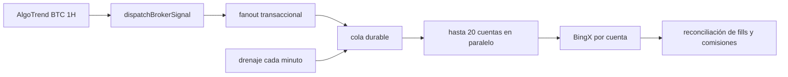

# Runbook de conexiones a brokers

Estado de referencia: 2026-07-18. La ejecución vive dentro del backend de `gonovi.app`; no requiere VPS, worker externo ni webhooks para AlgoTrend BTC 1H. Las cuentas reales sólo operan después de la aprobación administrativa y de habilitar los interruptores globales.

## Flujo operativo

1. `GET /api/cron/check` calcula AlgoTrend BTC 1H con velas cerradas.
2. El cron actualiza la operación interna y registra la apertura o cierre mediante `dispatchBrokerSignal`.
3. Una función transaccional de Supabase deduplica la señal, crea todas las intenciones y encola todos los trabajos.
4. `after()` reclama hasta 50 trabajos por tanda y ejecuta hasta 20 cuentas distintas en paralelo.
5. Dentro de cada cuenta se conserva el orden estricto; dos workers nunca procesan simultáneamente trabajos consecutivos de la misma conexión.
6. Antes de enviar la orden, el backend consulta balance, posiciones, precio y reglas del instrumento.
7. El motor de riesgo calcula la cantidad desde un notional fijo o desde el porcentaje compuesto aprobado para esa conexión.
8. El adapter de BingX envía la orden con un ID idempotente; la reconciliación posterior guarda fills, comisiones, PnL y posiciones.
9. Un drenaje de recuperación cada minuto procesa retries o reconciliaciones que no terminaron durante la ejecución inmediata.

El cron no se llama a sí mismo por HTTP. Tampoco depende de TradingView para transportar la señal. El endpoint firmado `/api/broker-signals` queda como entrada opcional para integraciones futuras, pero AlgoTrend BTC 1H usa una llamada interna.

## Componentes

- UI usuario: `/cuenta/seguridad` y `/cuenta/conexiones`.
- UI administrador: `/admin/conexiones`.
- Autenticación y datos: Supabase Auth, RLS y grants explícitos.
- Cifrado: AES-256-GCM por versión de credencial; RSA-OAEP-SHA256 protege la data key.
- Claves RSA: pública y privada sólo en variables server-side. Ninguna usa prefijo `NEXT_PUBLIC_`.
- Cola: `broker_execution_jobs`, reclamo atómico e idempotencia por señal/conexión.
- Ejecución: `src/lib/brokers/worker.ts`, invocada desde rutas server-side con `after()`.
- Broker inicial: BingX Perpetual Futures. El registry permite agregar adapters sin cambiar el flujo de señales.

La migración histórica de heartbeats puede permanecer en la base, pero ya no participa del flujo operativo.

## Permisos de API

La salida de Vercel usa IP dinámica. Por eso no se exige una allowlist de IP en BingX. La compensación obligatoria es una credencial de privilegio mínimo:

- Habilitar `Leer`.
- Habilitar únicamente trading de `Futuros Perpetuos`.
- Deshabilitar Spot.
- Deshabilitar retiros.
- Deshabilitar transferencias.
- Deshabilitar P2P.
- Deshabilitar administración de subcuentas.

Una clave pegada en chat, correo, captura o logs se considera comprometida y debe revocarse. Las credenciales se ingresan directamente en `/cuenta/conexiones`; la UI no vuelve a mostrar el secreto.

## Capital y riesgo

El usuario declara capital asignado, elige qué porcentaje usar por apertura (1–100%, 100% por defecto) y selecciona un perfil. No introduce lotes del activo. El servidor valida el monto contra precio, precisión, paso y mínimos reportados por BingX.

| Perfil | Pérdida diaria | Reserva objetivo |
| --- | ---: | ---: |
| Muy conservador | 1% | 70% |
| Conservador | 2% | 60% |
| Moderado | 3% | 50% |

Con USD 100 al 100%, la apertura autorizada es USD 100; con USD 1.000 al 100%, es USD 1.000. El titular puede elegir un porcentaje menor. La reserva se reduce cuando sea necesario para no solaparse con el importe por operación. El máximo global inicial es `1x`.

La aprobación administrativa se realiza una sola vez para habilitar la cuenta/API. Una conexión ya aprobada puede cambiar capital, porcentaje, lotaje por orden, pérdida diaria y modo de tamaño sin una segunda aprobación. El backend serializa el cambio, exige que no haya ejecuciones pendientes, reactiva la misma conexión y registra la auditoría.

**La plataforma no impone un techo propio sobre el lotaje ni sobre la pérdida diaria de una conexión aprobada.** El titular es responsable de su cuenta y configura el riesgo que quiera; el único límite real es el margen disponible en el broker, que rechaza lo que no pueda financiar. La exposición total y la reserva de margen se ajustan automáticamente al lotaje elegido: no son restricciones, evitan que la propia configuración del titular se auto-bloquee con `RISK_TOTAL_EXPOSURE_LIMIT` o `RISK_MARGIN_RESERVE`. No reintroducir validaciones del tipo "el lotaje no puede superar el capital".

El usuario elige el modo de tamaño al crear cada conexión:

- `Monto fijo`: el notional inicial se conserva en todas las entradas.
- `Interés compuesto`: cada entrada usa `porcentaje × capital gestionado actual`. El capital gestionado es el capital declarado más PnL realizado y comisiones reconciliadas de esa conexión. También se limita por el equity real disponible en el broker, por lo que un saldo Demo inflado no aumenta el lotaje.

Las políticas, el ledger y el cálculo están identificados por `connection_id`. Una cuenta de USD 150 al 100% abre USD 150; otra de USD 300 al 100% abre USD 300. Si el titular elige 5%, los importes serían USD 7,50 y USD 15 respectivamente. Sus resultados no se mezclan. Si una cuenta de USD 1.000 gana USD 29 netos, su siguiente entrada compuesta al 100% usa USD 1.029; con compuesto apagado permanece en USD 1.000.

La rentabilidad del activo se aplica a la posición, no automáticamente a todo el capital. Una posición de USD 50 que gana 3% produce USD 1,50 bruto antes de comisiones. Una posición de USD 1.000 con el mismo movimiento produce aproximadamente USD 30 bruto. El titular decide el capital autorizado y el porcentaje por operación.

## Reversos y operaciones no ejecutadas

Cuando la estrategia da vuelta la posición emite un cierre y enseguida una apertura contraria. El cierre puede estar confirmado en nuestros libros mientras el broker todavía reporta la posición. En esa ventana la reapertura **espera y reintenta** (`POSITION_SETTLEMENT_PENDING`, la intención queda en `QUEUED`) en vez de morir con `RISK_POSITION_LIMIT` o `RISK_FOREIGN_OPPOSITE_POSITION`, que son rechazos terminales. El gate sólo actúa si el broker sigue mostrando posición en ese símbolo y esta conexión acaba de cerrarla o la está cerrando; pasada la ventana de gracia vuelve la evaluación normal, así que un bloqueo real sigue dando su error propio.

Toda intención rechazada aparece en el panel del titular bajo «Operaciones que no se ejecutaron», con el motivo en castellano y, cuando la estrategia ya cerró ese trade, el resultado que se perdió. El porcentaje sale de los precios de referencia de las señales y es exacto; el importe en USD es bruto, estimado con el lotaje configurado y sin comisiones. Un cierre rechazado no genera resultado: la posición sigue viva.

Antes de abrir, el motor valida:

- conexión `ACTIVE` y política habilitada;
- símbolo permitido y binding `ALGOTREND_BTC_1H / BTC-USDT / 1h`;
- margen disponible y reserva posterior a la orden;
- notional por orden y exposición total;
- cantidad de posiciones y órdenes por minuto;
- pérdida realizada del día;
- reglas y mínimo del instrumento;
- ausencia de una posición ya abierta en la misma dirección.

Un cierre usa la cantidad real disponible en BingX y `reduceOnly`; no reutiliza el notional de apertura.

## Interruptores

- `BROKER_EXECUTION_ENABLED=false`: valida conexiones, pero no envía órdenes modulares.
- `BROKER_LIVE_EXECUTION_ENABLED=false`: bloquea cuentas `LIVE` aunque la ejecución general esté habilitada.
- `BINGX_LEGACY_EXECUTION_ENABLED=false`: mantiene desactivada la ruta directa anterior y evita órdenes dobles.
- conexión `SUSPENDED`: impide aperturas y conserva cierres controlados.
- conexión `REVOKED`: elimina el sobre cifrado y bloquea toda ejecución.

Los valores iniciales y de producción deben ser:

```text
BROKER_EXECUTION_ENABLED=false
BROKER_LIVE_EXECUTION_ENABLED=false
BROKER_MAX_ALLOWED_LEVERAGE=1
BINGX_LEGACY_EXECUTION_ENABLED=false
```

## Primera prueba BingX Demo

1. Revocar cualquier clave previamente compartida.
2. Crear una API de BingX Demo/VST con lectura y perpetuos solamente.
3. Completar MFA del administrador.
4. Ingresar la credencial en `/cuenta/conexiones` con entorno `DEMO` y capital declarado.
5. Confirmar que la validación pasa a `PENDING_APPROVAL`.
6. Aprobar exclusivamente `ALGOTREND_BTC_1H`, `BTC-USDT`, `1h`, `1x` y el notional conservador.
7. Habilitar `BROKER_EXECUTION_ENABLED=true` sólo en Preview; mantener live en `false`.
8. Ejecutar una señal controlada y comprobar intención, job, orden, fill, fee y posición.
9. Repetir el mismo `externalSignalId` y confirmar que no crea otra orden.
10. Ejecutar el cierre y verificar `reduceOnly`, cantidad real y ausencia de inversión accidental.
11. Reconciliar resultado y comisiones entre la app y BingX.
12. Volver a desactivar la ejecución al terminar.

## Latencia y capacidad

El camino crítico no espera reconciliación de fills ni snapshots. Las reglas públicas del contrato se comparten durante cinco minutos y el ticker durante 500 ms entre cuentas atendidas por la misma instancia. Cada cuenta conserva consultas privadas e independientes para balance, posiciones, modo y orden.

Objetivos operativos iniciales:

| Cuentas activas por señal | Objetivo | Condición |
| ---: | --- | --- |
| 1-25 | p95 señal a envío menor a 3 s | Piloto y operación normal |
| 26-50 | p95 menor a 5 s | Rango recomendado antes de una prueba de carga mayor |
| 51-100 | Menor a 20-25 s | Capacidad teórica del runner actual; requiere prueba controlada |
| Más de 100 | Sin garantía en una sola invocación | Dividir workers horizontalmente y medir límites externos |

Estos números son presupuestos de diseño, no una promesa del broker. La validación para subir cada umbral exige señales sintéticas con cuentas Demo y revisión de `queueLatencyMs`, `executionLatencyMs`, cola más antigua, jobs fallidos y rate limits. El panel administrativo muestra cola, procesamiento, fallos y p95 histórico.



## Ruta heredada

`safeExecuteBingxOpen` y `safeExecuteBingxClose` sólo se ejecutan si `BINGX_LEGACY_EXECUTION_ENABLED=true`. Producción debe mantener ese interruptor ausente o en `false`; la plataforma modular es la única ruta autorizada para cuentas administradas.

## Estados

- `PENDING_VALIDATION`: esperando validación de credencial.
- `PENDING_APPROVAL`: credencial válida; falta política del administrador.
- `ACTIVE`: puede operar según binding, riesgo e interruptores.
- `SUSPENDED`: sólo admite cierres controlados.
- `VALIDATION_FAILED`: la validación falló; rotar o revalidar.
- `MANUAL_INTERVENTION_REQUIRED`: requiere revisión directa en el broker.
- `REVOKED`: credencial local eliminada y conexión bloqueada.

## Incidentes

1. Poner `BROKER_EXECUTION_ENABLED=false`.
2. Suspender la conexión afectada.
3. Revisar posición real en BingX antes de modificar datos locales.
4. Revocar la API en BingX si existe sospecha de exposición.
5. Rotar la credencial desde la app.
6. Revisar auditoría, jobs, órdenes, fills y ledger sin registrar secretos.
7. Reanudar sólo después de reconciliar el estado remoto.

## Verificación

```bash
npm run typecheck
npm run test:brokers
npm run lint
npm run build
npx supabase db lint --linked --schema public
npm audit --omit=dev
```

El piloto comienza en Preview y Demo. Publicar código no habilita operaciones: los dos interruptores server-side y la aprobación por conexión son controles independientes.
